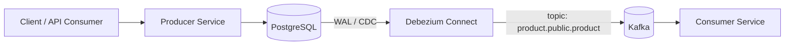

# Spring Boot CDC Pipeline (PostgreSQL + Debezium + Kafka)

This repository demonstrates a complete Change Data Capture (CDC) flow using PostgreSQL, Debezium, and Kafka with two Spring Boot services:

- Producer service: CRUD API for product data persisted to PostgreSQL
- Consumer service: Kafka consumer that processes Debezium CDC events (`create`, `update`, `delete`)

## Architecture



## Tech Stack

- Java 21
- Spring Boot 3
- Spring Data JPA
- Spring Kafka
- PostgreSQL
- Debezium Connect
- Docker Compose
- OpenAPI / Swagger UI

## Modules

- `spring-debezium-db-kafka-producer`: REST API and database writer
- `spring-debezium-db-kafka-consumer`: CDC event processor

## Local Infrastructure

Start the local stack:

```bash
docker compose up -d
```

Services:

- PostgreSQL: `localhost:5432`
- Kafka broker (host): `localhost:29092`
- Debezium Connect REST API: `localhost:8083`
- Kowl UI: `localhost:8090`
- PgAdmin: `localhost:5051`

## Start Applications

Run from project root:

```bash
mvn clean install
```

Then run each module:

```bash
mvn -pl spring-debezium-db-kafka-producer spring-boot:run
mvn -pl spring-debezium-db-kafka-consumer spring-boot:run
```

## Create Debezium Connector

Check connectors:

```http
GET http://localhost:8083/connectors
```

Create connector:

```http
POST http://localhost:8083/connectors
Content-Type: application/json

{
  "name": "dgm",
  "config": {
    "connector.class": "io.debezium.connector.postgresql.PostgresConnector",
    "tasks.max": "1",
    "database.hostname": "db",
    "database.port": "5432",
    "database.user": "postgres",
    "database.password": "1234567890",
    "database.dbname": "dgm",
    "topic.prefix": "product",
    "table.include.list": "public.product",
    "plugin.name": "pgoutput",
    "tombstones.on.delete": "false",
    "heartbeat.interval.ms": "5000",
    "key.converter": "org.apache.kafka.connect.json.JsonConverter",
    "key.converter.schemas.enable": "false",
    "value.converter": "org.apache.kafka.connect.json.JsonConverter",
    "value.converter.schemas.enable": "false",
    "decimal.handling.mode": "double"
  }
}
```

Delete connector:

```http
DELETE http://localhost:8083/connectors/dgm
```

## Debezium Delete Event Note

To include full `before` payload for delete events:

```sql
ALTER TABLE product REPLICA IDENTITY FULL;
```

## API Endpoint

Producer API base URL: `http://localhost:9999/products`

- `POST /products`
- `GET /products`
- `GET /products/{id}`
- `PUT /products/{id}`
- `DELETE /products/{id}`